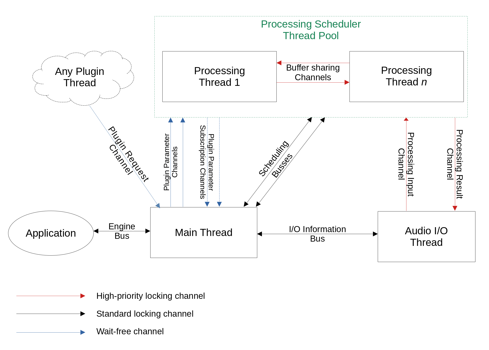

# Dropseed Design Document

TODO

# Objectives

TODO

* Multiplatform
* Multithreaded
* Routing-Agnostic (only based on the graph, does not know about sends or busses)
* Idempotent (loading/saving graph state)
* Defensive (plugins sending erroneous events)
* Supports running in an isolated process
* Supports standard plugin types (CLAP, VST3) (maybe later: VST2, AU?, LV2?)
* Supports custom plugins

## Non-goals

* Modularity (removing, adding or replacing pieces of the audio engine) TODO: reword
* Does not connect to system devices itself
* Does not come with any suite of included plugins
* Does not provide any GUI tools: it will simply pass through `RawWindowHandle`s for plugins that request them for GUI 
  embedding.

# API

API has three main parts:

* The main handle
* The audio processor
* The custom plugin API

TODO: detail each part

# Internal architecture

## Thread model

In order to maximize CPU usage efficiency, Dropseed uses multiple threads to process both audio and user events: 

### Thread types

* The **Main Thread** hosts the Scheduler, and orchestrates all non-realtime operation of the engine.
  It is designed to stay out of the way of the processing structure: because it does not handle any audio data or events,
  even a completely frozen Main Thread cannot interfere and cause drops or Xruns.

  Its main role is to handle scheduling, receiving updates to the audio graph from the application user, recompiling 
  the graph, and both sending out and synchronizing schedule updates to the different Audio and Processing threads.
  In order to make schedule updates as quick as possible, it also handles allocation and de-allocation of all buffers
  and plugin changes caused by each schedule update.

  Additionally, it also handles passing plugin parameters between the Application, the Plugin UI and the Processing
  threads, as well as other plugin-originated events.
* The **Audio I/O Thread** hosts the Audio Processing API. Its main purpose is to receive Audio and MIDI data from
  device buffers, send it over to the processing thread pool, and send the result back to the devices. It also handles
  all transport synchronization.

  Because its purpose is to be triggered to start processing from device/system clocks, it is the only thread which
  lifetime is not managed by Dropseed. The thread itself is actually created from user application code (e.g. from 
  `rainout` or `cpal`).
* **Processing Threads** constitute a pool of worker threads, and handle all the expensive DSP work.

  For the most part, they will wait for an input or trigger from the Audio I/O thread, at which point they will start
  following their DSP schedule as quickly as possible, to hopefully complete in time to send back to the Audio I/O
  thread.

  While DSP schedules are mostly linear, synchronization-free processing, the schedule may at some point require the
  thread to wait for results from other threads' schedules if they are needed for the current one. This may be the case
  for e.g. mixing busses or side-chaining.
* Additionally, extra **Plugin Threads** may have been created by plugins, for instance to communicate with specific
  hardware. These threads are entirely managed by the plugin, therefore making the host (i.e. Dropseed) completely
  unaware of them. Therefore, the only part of the engine these threads have access to is the *Plugin Request Channel*,
  a one-way channel they can use to request various idempotent actions from the engine.

### Channel types

* **High-priority locking channels** are used for all communication that DSP is going to be actively waiting on. These
  require the lowest possible latency (hence the use of locks), and messages received from these channels must be
  processed before even checking lower-priority channels.

  Because of this property, these types of channels are used sparingly, as using them to perform too many operations may
  result in starvation during high loads. In our case they are only used for DSP processing, and the whole DSP
  processing circuit can still be completed without ever reading from other channels. And since all DSP is always
  triggered by the application code (using the Audio Processor API), it always has control over DSP execution and has
  the ability to interrupt starvation scenarios at any time.

  These channels are currently implemented using `crossbeam` channels that are always selected first relative to other
  channels.
* **Standard locking channels** are used for all communication that's not on the DSP hot path, but may still affect DSP,
  e.g. Schedule updates which will still pause all DSP until all threads are ready to continue.

  These channels don't require absolute priority (as DSP can ignore it and still continue running in an outdated
  configuration), but they still benefit from lower latency to make sure scheduling updates are performed as quickly as
  possible.

  These channels are also implemented using `crossbeam` channels, but they are selected with a lower priority than their
  High-priority DSP counterparts.
* **Wait-free channels** are used wherever waiting is not acceptable (mainly during DSP), whenever a large amount of
  small messages may be sent (e.g. parameter changes), but where timing and latency are not critical.

  Threads reading from these channels must never wait on anything from them, and may perform reads at their own leisure 
  without any timing or latency considerations (mostly once per DSP calls, or on a distinct idle timer). 

  These channels can be implemented using `rtrb` queues for SPSC operation, or in the special case of the Plugin Request
  Channel, atomic bitflags are used for MPSC operation.
### Channel layout

TODO
* The **Processing Channels**.

## Possible workflows

TODO:

* Audio processing
  * Thread triggered by audio input
  * Thread triggered by processing request
  * Thread waiting on buffer from other thread
* Plugin deactivation & reactivation
* Schedule updates
  * Single thread targeted
  * Multiple threads targeted
  * Nodes being moved across threads
* Processing thread count changed
* Audio engine shutdown (stops all threads)
* Audio sample rate change
* TODO: possibly more

## The Audio Graph Scheduler

## Buffer sharing model

TODO